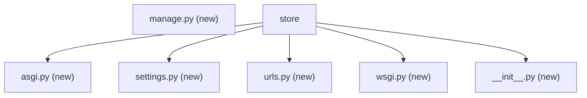

# Django File Structure
Generated at: 2025-07-16 13:03

```mermaid
graph TD
    manage_py["manage.py (new)"]
    store --> store\asgi_py
    store\asgi_py["asgi.py (new)"]
    store --> store\settings_py
    store\settings_py["settings.py (new)"]
    store --> store\urls_py
    store\urls_py["urls.py (new)"]
    store --> store\wsgi_py
    store\wsgi_py["wsgi.py (new)"]
    store --> store\__init___py
    store\__init___py["__init__.py (new)"]
```